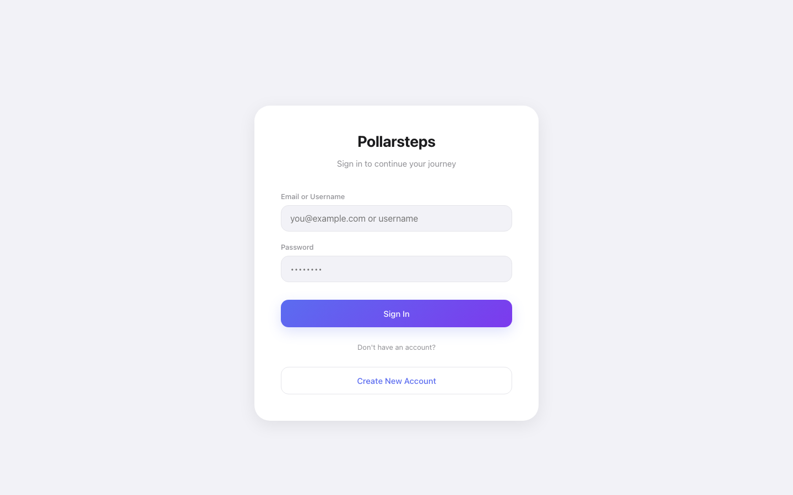
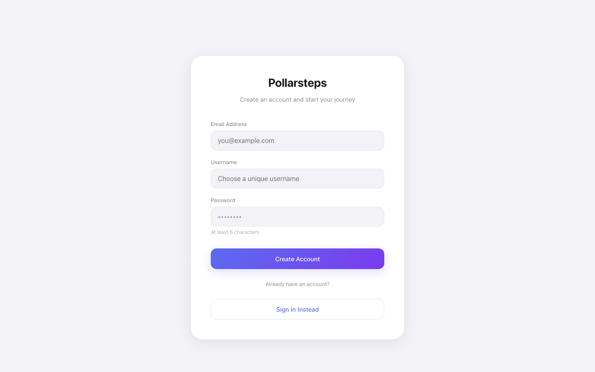
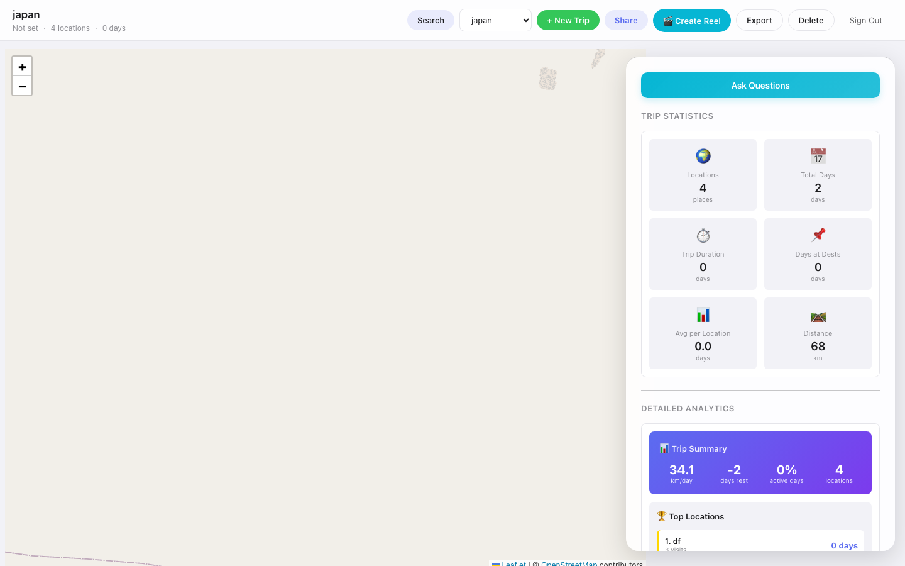
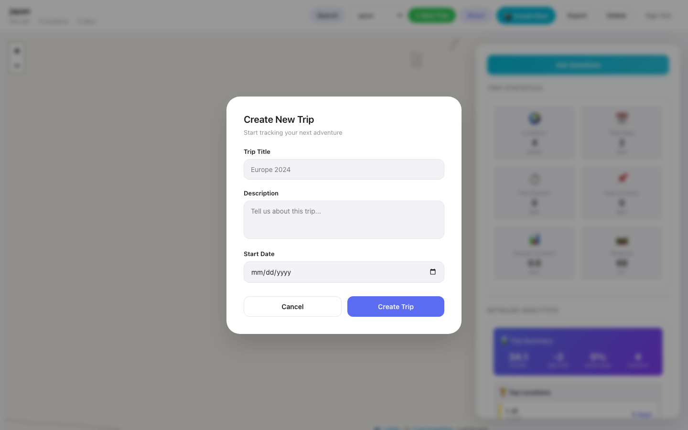

<div align="center">

# 🗺️ Pollarsteps

**Track your travels on an interactive map**
Add locations as you go, attach photos, get AI-powered recommendations, and share your trips with friends.

[](https://fastapi.tiangolo.com)
[](https://nextjs.org)
[](https://www.typescriptlang.org)


</div>

---

## 📸 Screenshots

| Sign In | Sign Up |
|:-------:|:-------:|
|  |  |

| Map View | Create Trip |
|:--------:|:-----------:|
|  |  |

---

## ✨ Features

| | |
|---|---|
| 🗺️ **Interactive Map** | Click anywhere to add a location and visualize your route |
| ✈️ **Trip Management** | Create trips, set dates, share publicly or keep private |
| 📍 **Location Steps** | Add notes and photos at each stop |
| 🤖 **AI Recommendations** | Suggestions for restaurants, activities, and attractions |
| 📖 **Stories & Reels** | Turn trips into shareable slideshows with music |
| 📊 **Analytics** | Distance traveled, days per destination, trip stats |
| 🌓 **Dark / Light Mode** | Automatic theme switching |

---

## 🚀 Getting Started

### Prerequisites

- Python 3.9+
- Node.js 18+

### 1 — Install dependencies

```bash
# Backend
cd backend_app
python3 -m venv .venv && source .venv/bin/activate
pip install -r requirements.txt

# Frontend
cd ../frontend && npm install
```

### 2 — Configure environment

```bash
cp backend_app/.env.example backend_app/.env
cp frontend/.env.example frontend/.env.local
```

| File | Variable | Notes |
|------|----------|-------|
| `backend_app/.env` | `JWT_SECRET_KEY` | Any long random string |
| `backend_app/.env` | `GEMINI_API_KEY` | AI features (optional) |
| `frontend/.env.local` | `NEXT_PUBLIC_MAPBOX_TOKEN` | Map tiles (optional) |

### 3 — Run

```bash
# Terminal 1 — Backend
cd backend_app
PYTHONPATH=. uvicorn app.main:app --reload --host 127.0.0.1 --port 8000

# Terminal 2 — Frontend
cd frontend && npm run dev
```

> 🌐 App: **http://localhost:3000** · API Docs: **http://127.0.0.1:8000/docs**

---

## 🛠️ Tech Stack

| Layer | Technologies |
|-------|-------------|
| **Backend** | FastAPI · SQLite · SQLAlchemy (async) · Pydantic v2 · JWT |
| **Frontend** | Next.js 14 · TypeScript · Tailwind CSS · Leaflet |
| **AI** | Gemini API — recommendations & journal entries |
| **DevOps** | Docker · Docker Compose |

---

## 📁 Project Structure

```
Pollarsteps/
├── backend_app/          # FastAPI backend
│   └── app/
│       ├── api/          # Route handlers
│       ├── models/       # SQLAlchemy ORM models
│       ├── schemas/      # Pydantic validation
│       ├── services/     # Business logic
│       └── core/         # DB, auth, config
├── frontend/             # Next.js 14 frontend
│   ├── app/              # Pages
│   ├── components/       # React components
│   └── lib/              # API client & utilities
├── services/
│   └── travel_intelligence/  # Analytics microservice
├── tests/                # Integration tests
├── docs/                 # Architecture & API reference
└── scripts/              # Dev helper scripts
```

---

## 📜 Scripts

```bash
bash scripts/setup.sh    # First-time setup
bash scripts/dev.sh      # Start both servers
bash scripts/test.sh     # Run tests
bash scripts/clean.sh    # Clean build artifacts
```

---

## 📚 Docs

- [Architecture](docs/ARCHITECTURE.md)
- [API Reference](docs/API_REFERENCE.md)
- [Developer Guide](docs/DEVELOPER_GUIDE.md)

---

<div align="center">
MIT License · Built with ❤️ by <a href="https://github.com/DORI2001">Dori</a>
</div>
