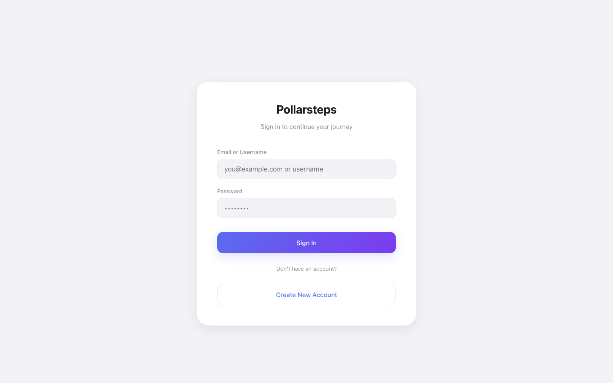
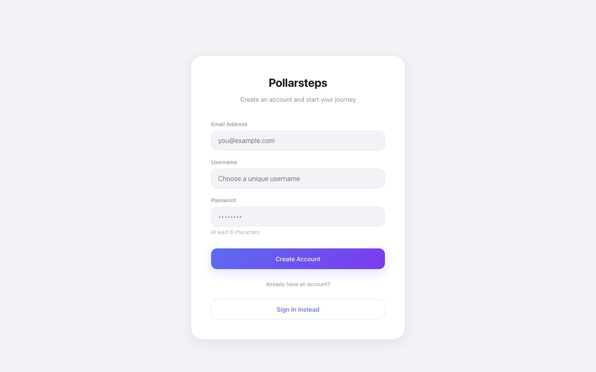
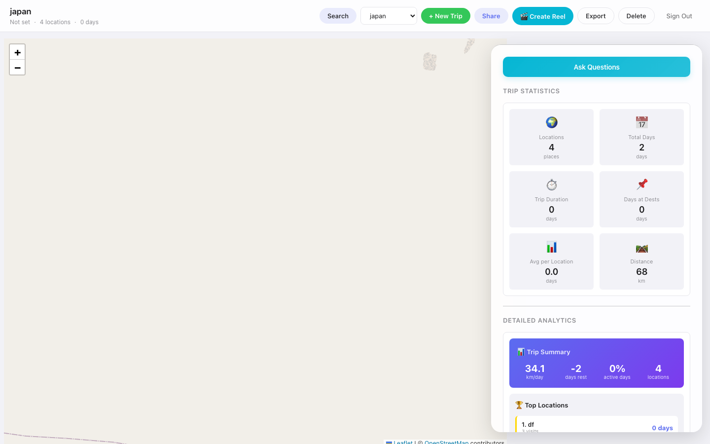
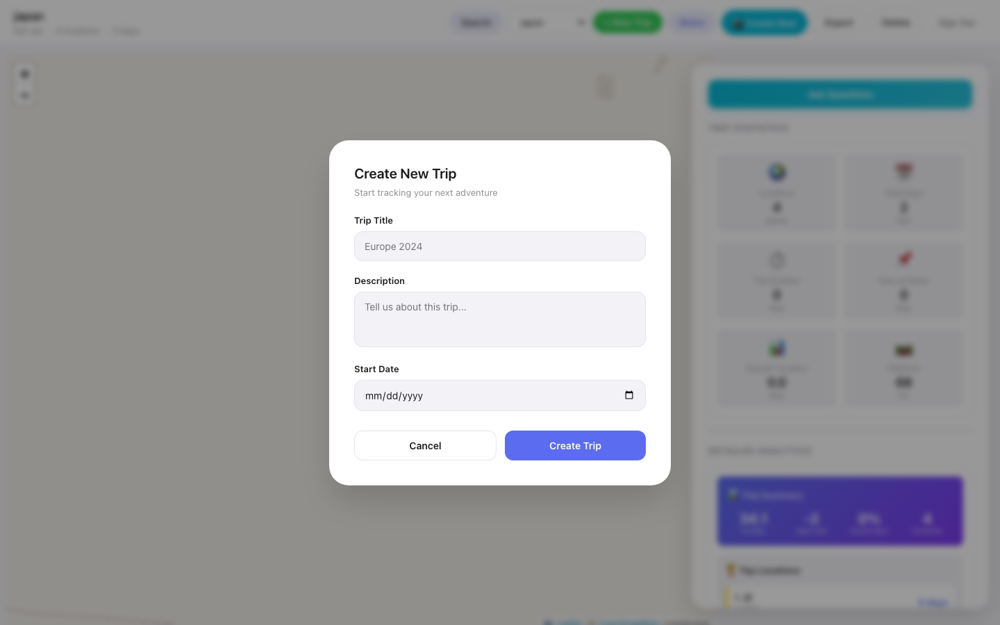

<div align="center">

# 🗺️ Pollarsteps

**Track your travels on an interactive map —**
add locations as you go, attach photos and memories, get AI-powered recommendations, and share your trips with the world

[](https://fastapi.tiangolo.com)
[](https://nextjs.org)
[](https://www.typescriptlang.org)

</div>

---

## 📸 Screenshots

| Sign In | Sign Up |
|:-------:|:-------:|
|  |  |

| Map View | Create Trip |
|:--------:|:-----------:|
|  |  |

---

## ✨ Features

| | |
|---|---|
| 🗺️ **Interactive Map** | Click anywhere on the Leaflet map to drop a step; route line updates in real time |
| ✈️ **Trip Management** | Create, edit, split, and delete trips; map auto-centers on your latest location |
| 📍 **Location Steps** | Notes, photos, and duration per stop; location name auto-resolved via reverse geocoding |
| 🤖 **AI Recommendations** | Gemini-powered suggestions for restaurants, activities, and attractions near any step |
| 📖 **AI Chronicle** | Generate a narrative journal entry for your trip using Gemini |
| 🎬 **Story Reels** | Slideshow reel with YouTube soundtrack, configurable duration, and a shareable link |
| 📷 **Photo Gallery** | Full-trip photo grid in a single modal |
| 📊 **Trip Stats** | Distance traveled, days per destination, average pace — collapsible detail panel |
| 🔗 **Sharing** | Generate a public share link for any trip; revoke at any time |
| 👥 **Collaboration** | Invite other users as viewers or editors |
| 🌙 **Dark / Light theme** | System-aware with manual toggle |
| 🔒 **Auth** | JWT access + refresh tokens, rate-limited endpoints, secure headers |

---

## 🚀 Getting Started

### Prerequisites

- Python 3.9+
- Node.js 18+

### 1 — Install dependencies

```bash
# Backend
cd backend_app
python3 -m venv .venv && source .venv/bin/activate
pip install -r requirements.txt

# Frontend
cd ../frontend && npm install
```

### 2 — Configure environment

```bash
cp backend_app/.env.example backend_app/.env
cp frontend/.env.example frontend/.env.local
```

| File | Variable | Notes |
|------|----------|-------|
| `backend_app/.env` | `JWT_SECRET_KEY` | `python -c "import secrets; print(secrets.token_urlsafe(64))"` |
| `backend_app/.env` | `DATABASE_URL` | SQLite default; `postgresql+asyncpg://...` for production |
| `backend_app/.env` | `GEMINI_API_KEY` | Required for AI recommendations and chronicle |
| `frontend/.env.local` | `NEXT_PUBLIC_API_BASE` | Backend URL, e.g. `http://localhost:8000/api` |
| `frontend/.env.local` | `NEXT_PUBLIC_MAPBOX_TOKEN` | Satellite map tiles (optional — falls back to OpenStreetMap) |

### 3 — Run

```bash
# Terminal 1 — Backend
cd backend_app
PYTHONPATH=. uvicorn app.main:app --reload --host 127.0.0.1 --port 8000

# Terminal 2 — Frontend
cd frontend && npm run dev
```

> 🌐 App: **http://localhost:3000** · API docs: **http://127.0.0.1:8000/docs**

---

## 🛠️ Tech Stack

| Layer | Technologies |
|-------|-------------|
| **Backend** | FastAPI · SQLite / PostgreSQL · SQLAlchemy (async) · Pydantic v2 · JWT |
| **Frontend** | Next.js 14 · TypeScript · Leaflet · inline theme system (light/dark) |
| **AI** | Google Gemini — recommendations, AI chronicle |
| **Geocoding** | Nominatim (reverse) · OpenStreetMap forward search via backend proxy |
| **Infra** | Docker · Docker Compose |

---

## 📁 Project Structure

```
Pollarsteps/
├── backend_app/
│   └── app/
│       ├── api/
│       │   ├── routes/       # Thin route handlers (deserialize → service → serialize)
│       │   └── deps.py       # FastAPI dependencies (auth, DB session)
│       ├── models/           # SQLAlchemy ORM models
│       ├── schemas/          # Pydantic request/response schemas
│       ├── services/         # Business logic (trips, steps, AI, geocoding)
│       └── core/             # DB init, auth, config
├── frontend/
│   ├── app/                  # Next.js pages (signin, signup, shared trip viewer)
│   ├── components/           # React components & modals
│   ├── hooks/                # Domain hooks (useTrips, useCurrentTrip, useSearch, …)
│   ├── lib/                  # API client, geocoding, export, search, theme
│   └── providers/            # TripProvider — 5 focused React contexts
├── docs/                     # Architecture & API reference
├── scripts/                  # Dev helper scripts
└── tests/                    # Integration tests
```

---

## 📜 Scripts

```bash
bash scripts/setup.sh    # First-time setup
bash scripts/dev.sh      # Start both servers
bash scripts/test.sh     # Run tests
bash scripts/clean.sh    # Clean build artifacts
```

---

## 📚 Docs

- [Architecture](docs/ARCHITECTURE.md)
- [API Reference](docs/API_REFERENCE.md)
- [Developer Guide](docs/DEVELOPER_GUIDE.md)

---

<div align="center">
Built with ❤️ by <a href="https://github.com/DORI2001">Dori</a>
</div>
